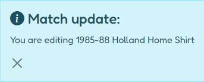
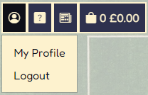
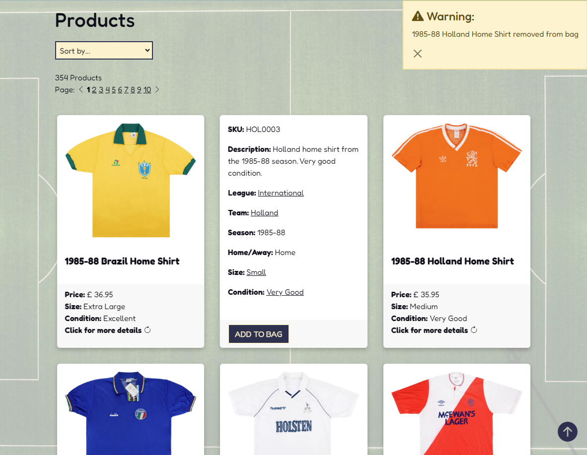
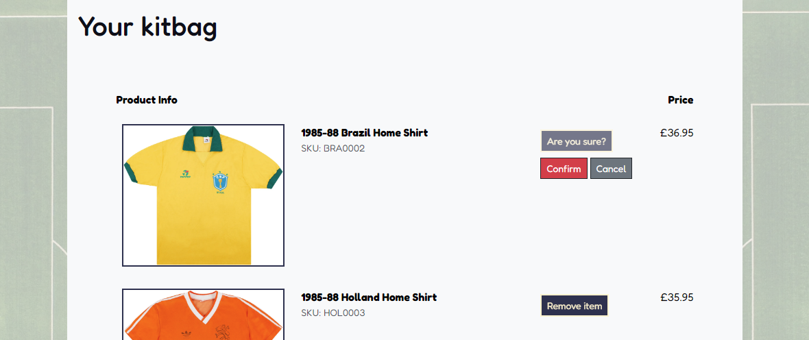
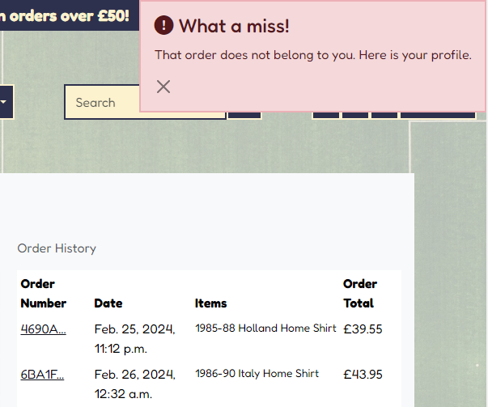

# Jumpers For Goalposts Website


This project creates an eCommerce website for a fictional business called Jumpers For Goalposts. It allows external users to browse and buy retro football shirts, and allows site admins to add, edit and update products. The site is designed to be responsive and accessible on a range of devices, making it easy to navigate for external users and site admins alike.

[View the live project here](https://jumpers-for-goalposts-13c54c4e6e2a.herokuapp.com/)


## Table of Contents

1. [Project Goals](#project-goals)
2. [Project Guide](#project-guide)
3. [User Stories](#user-stories)
4. [Design](#design)
5. [Features](#features)
6. [Testing](#testing)
7. [Tecnologies Used](#technologies-used)
8. [Deployment](#deployment)
9. [Credits](#credits)


## Project Goals

### Purpose

An e-commerce site selling retro football shirts, which allows customers to browse and buy such shirts, while allowing site admins to add, edit and delete products.

### Client Goals

The client is a fictional business called Jumpers For Goalposts. Their goals are to:
- Have an engaging site which attracts interest from buyers of retro football shirts.
- Drive sales of their retro football shirts by making the browsing and buying of products as straightforward as possible.
- Minimise avoidable contact by providing easy-to-find information to potential buyers. 

### User Goals

The primary goals of the user are to:
- Browse retro football shirts using a variety of methods such as keyword searching, browsing by feature and listing based on different criteria.
- Purchase selected shirts securely.
- Find information about previous orders they have made.

Detailed user stories are provided in the [User Stories](#user-stories) section below.

## Project Guide

I used [Code Institute](https://learn.codeinstitute.net/)'s [Boutique Ado](https://github.com/Code-Institute-Solutions/boutique_ado_v1) walkthrough project as a guide throughout development. While it would be impractical to credit every part of Boutique Ado code within the code itself, this document will clearly explain the custom features which have been added over and above the Boutique Ado project.

## User Stories

A. As a **first-time visitor** I want to:
1. Establish what products are available on the site.
2. Browse products using easy-to-follow navigation.
3. Find answers to my questions.
  
B. As a **returning visitor** I want to:
1. Browse and search for specific products using a variety of methods.
2. Purchase selected products.
3. View details of my previous orders.  

C. As a **staff user** I want to:
1. Add products to the inventory.
2. Edit or delete existing products in the inventory.
3. View sold items and mark them as unsold if necessary.

D. As a **superuser**, in addition to the admin functions outlined above, I want to:
1. Receive details of customer orders to be fulfilled.
2. Add or edit product categories.
3. Add or remove admins and amend their privileges. 

## Design

### Wireframes

Wireframes were created using the Figma platform: [Figma - Jumpers For Goalposts](https://www.figma.com/file/uwlFESlwKMuzSo25F4ccFt/Jumpers-For-Goalposts?type=design&node-id=0%3A1&mode=design&t=lA9PFoLqKGXvNOGx-1)

<details><summary>Desktop wireframes</summary>


</details>

<details><summary>Mobile wireframes</summary>


</details><br>

Based on prior experience I decided that desktop and mobile wireframes would be sufficient to keep the overall layout of the site on track, the expectation being that [Bootstrap's grid system](https://getbootstrap.com/docs/5.3/layout/grid/) would provide the responsiveness required at different device breakpoints in between (see [Layout and Styling](#layout-and-styling) section below).

Furthermore, I focused the wireframes on the main product purchase workflow, recognising that this was where design choices would be key. The other pages contain simple forms and tables, so I considered there to be little value in producing specific wireframes for those pages.

#### Differences between wireframes and final design

The wireframes include a separate product details page (shown in the desktop wireframes only and labelled "not used"). However, during development I realised that I could reduce unnecessary navigation and provide a smoother user experience by keeping the user on the same page and simply flipping the product card to display the product details.

Most other key features of the wireframes are retained in the final implementation, although aspects of the layout have evolved during the design and development process.

### Layout and Styling

#### Bootstrap

The site uses the [Bootstrap 5.3 Grid system](https://getbootstrap.com/docs/5.3/layout/grid/) to ensure it is fully responsive on all device and viewport sizes. Bootstrap 5.3 uses the following [breakpoints](https://getbootstrap.com/docs/5.3/layout/breakpoints/), the shorthand references for which are used throughout the rest of this document:

| Breakpoint        | Shorthand   | Dimensions |
|-------------------|-------------|------------|
| Extra small       | xs          | <576px     |
| Small             | sm          | ≥576px     |
| Medium            | md          | ≥768px     |
| Large             | lg          | ≥992px     |
| Extra large       | xl          | ≥1200px    |
| Extra extra large | xxl         | ≥1400px    |

In addition, the site uses the following specific components from the Bootstrap library:

- [Navbar](https://getbootstrap.com/docs/5.3/components/navbar/) for the header.
- [Cards](https://getbootstrap.com/docs/5.3/components/card/) to display product information on the products page.
- [Accordion](https://getbootstrap.com/docs/5.3/components/accordion/) to provide a collapsible menu for the FAQs.
- [Alerts](https://getbootstrap.com/docs/5.3/components/alerts/) to display status messages.
- [Modal plugin](https://getbootstrap.com/docs/5.3/components/modal/) to display enlarged product images on click.
- [Spacing](https://getbootstrap.com/docs/5.3/utilities/spacing/) and [typography](https://getbootstrap.com/docs/5.3/content/typography/) utility classes throughout, ensuring the layout and font are appropriate to the device in use.
- [Color](https://getbootstrap.com/docs/5.3/utilities/colors/) utility classes to provide specific meaning to text throughout.
- [Display property](https://getbootstrap.com/docs/5.3/utilities/display/) to toggle the visibility of some components at certain breakpoints.

#### Media queries

In addition to the responsive layout provided by Bootstrap, specific media queries are used to rotate the main background image to match the orientation of the device, and to change the sizes of the club badges on the home page.

### Imagery

- The **Logo** is a retro-looking football badge, created using a template by [Kulokale on Canva](https://www.canva.com/templates/EAFNwkE8v5Y-retro-and-vintage-football-club-logo). 

- The **Background image** is an aerial photo of a football pitch, courtesy of [Timothy Tan on Unsplash](https://unsplash.com/photos/green-sports-court-illustration-PAe2UhGo-S4). The image is displayed in portrait or landscape depending on the orientation of the device in use, and a partially opaque overlay is placed over it throughout the site to ensure clarity of site content.

- The **404 (Page Not Found)** error page includes a photo of a football going wide of a goal, courtesy of [Omar Ram on Unsplash](https://unsplash.com/photos/man-in-red-shirt-and-black-pants-playing-soccer-during-daytime-IvXnC7u6yD0)

- The **club badges** on the home page are sourced from [Wikipedia](https://en.wikipedia.org/). Their use in this instance for educational purposes is considered to represent fair use.
  
  <details><summary>Logo</summary>
  
  
  
  </details>

  <details><summary>Background image</summary>
  
  
   
  </details>

  <details><summary>404 image</summary>
  
  
   
  </details>

### Colour Scheme
  
- The **main colours** used for site components (such as navigation items and buttons) are blue (#2C314F) and cream (#FFF2CD) to match the logo. These colours provide a contrast to the pale green background, and are distinctive enough to give the company a brand identity. Importantly, these colours are not associated with any major football team, and so will appear neutral to football fans visiting the site.  

- The **button hover** colour is dark blue (#0D0F18), which is different enough to provide the necessary effect without detracting from the overall colour scheme. 

- Body **text** is the same dark blue (#0D0F18), while Boostrap's utility classes are used to convey meaning to text throughout, such as .text-danger (#DC3545) for urgent warnings.

  <details><summary>Colour scheme palette</summary>

  

  </details>

### Typography

- The site uses [Fredoka](https://fonts.google.com/specimen/Fredoka) throughout, imported from [Google Fonts](https://fonts.google.com/). Fredoka is a retro-looking font which fits with the theme and aesthetic of the site.

    <details><summary>Fredoka font</summary>

    

    </details>

### Icons

- [Bootstrap Icons](https://icons.getbootstrap.com/) have been used for **navigation items**, **alerts** and various **buttons**, utilised as classes in the `<i>` tag.

  <details><summary>Navigation icons</summary>

  

  </details>

  <details><summary>Alerts</summary>

  
  
  
  

  </details>

  <details><summary>Button</summary>

  

  </details>
  
### Favicon

- The **favicon** is the football from the logo, generated using [Favicon Generator](https://www.favicon-generator.org/).

  <details><summary>Favicon</summary>

  

  </details>

### Loading spinner

- The site utilises a **loading spinner** on the checkout page to illustrate that a page is loading. This is also the football from the logo, but with shadowing removed.

  <details><summary>Loading Spinner</summary>

  

  </details>


## Features

### Scope

- #### Minimum Viable Product

  To be viable as an eCommerce site for retro football shirts and meet the stated [Project Goals](#project-goals), the website **must have**:
  - Images and details of products for sale.
  - A way for potential customers to browse products.
  - A method for allowing customers to purchase selected products.
         
- #### Additional Features (in scope)

  To provide a good user experience in line with the stated [Project Goals](#project-goals), the website **should have**:
  - Sophisticated browsing, searching and list ordering functionality to allow customers to find products through a variety of methods.
  - A secure payment system utilising a recognised, trusted payment provider.
  - A user registration system, allowing users to save delivery details and view past orders.
  - An FAQ section to provide answers to the most commonly asked questions and minimise avoidable contact from customers.
  - Newsletter sign-up, allowing the business to keep customers up-to-date with news and special offers.
   
- #### Future Ideas (not currently in scope)
  
   To provide a better user experience and better meet the stated [Project Goals](#project-goals), the website also **could have**:
   - The option for registered users to select their favourite team(s), which would allow for prioritisation of those shirts when browsing, as well as alerts when new items relating to that team are added.
   - The ability for a superuser to dynamically update the team badges displayed on the front page, allowing them to promote different teams at different times based on current events (e.g. promoting the two teams appearing in a cup final).
   - A newsletter creation function, allowing admins to easily create and send newsletters via a form.
   - A wishlist feature, allowing users to add items to a virtual bag for purchase at a later date. 

### Python Functionality using Django

Python has been used to build the core backend application which underpins the site, utilising the [Django web framework](https://www.djangoproject.com/). In particular, Python and Django have been used to:

- Provide routing of pages, allowing meaningful URLs to be used to return pages and content to the user.
- Connect to the backend database to retrieve information and serve it to the site, and to allow creation, updating and deletion of records.
- Provide login functionality and security, ensuring only authorised users can access and edit particular information.
- Display messages to the user (via [Bootstrap Alerts](https://getbootstrap.com/docs/5.3/components/alerts/)).

### Database

The backend application connects to a Postgres database hosted on [Amazon Web Services](https://aws.amazon.com/free/database/).

#### Schema

 A number of models were created, as illustrated below. Here the application which the model belongs to is shown before the underscore.


Below is a more detailed breakdown of these models and their basis.

##### Django models

- **user**: Part of the [Django allauth](https://docs.allauth.org/en/latest/) app, which provides secure authentication and registration. It is included above to illustrate its relationship with the userprofile model.

##### Models adapted from Boutique Ado

- **userprofile**: Allows an authenticated user to save default name and delivery information.
- **order**: Collects information on a customer's order for use in the checkout process.
- **orderlineitem**: Collects information on individual items in an order.
- **product**: Provides all relevant information about a product. While this is adapted from the Boutique Ado walkthrough, it has been adapted considerably. In particular, rather than a single category field it includes multiple categories linking to other models (**league**, **team** and **condition**), as well as multiple other fields relating to product characteristics (**home_away**, **season**, **player_issue**, **signed** and **year**). It also includes a **sold** field (boolean), allowing a product to marked as sold without deleting it from the database.

##### Custom models

- **league**: Allows both shirts and teams to be categorised based on the league from which they come.
- **team**: Allows products to be categorised by the team to which they belong. Also allows newsletter subscribers to indicate their favourite team.
- **condition**: Allows products to be categorised based on their condition.
- **subscriber**: Allows users to subscribe to a newsletter by providing their name and email address. Optionally allows users to indicate their favourite team and opt into updates about their favourite team only.
- **faq**: Allows admins to create questions and answers for display on the site.

#### Content

Database content was sourced from a [Football Kits Dataset](https://www.kaggle.com/datasets/afaksnmez/football-kits-dataset), provided by [safaksonmezz on Kaggle](https://www.kaggle.com/afaksnmez). The dataset comprises data scraped from a real website called [Classic Football Shirts](https://www.classicfootballshirts.co.uk/).

The data was cleaned, pruned, and then converted to JSON and formatted as a Django fixture for uploading to the database. Images were downloaded from the [Classic Football Shirts](https://www.classicfootballshirts.co.uk/) website, with dead links being removed.

### Page Elements and Interaction

The website provides different functionality depending on the user's credentials. In general:
- **Public users**: Can browse for products, add them to their bag and securely check out. In addition, they can view general site content including FAQs, and subscribe to the newsletter. They also have the ability to sign up to become a registered user.
- **Registered users**: As well as the above, they can update their profile with default contact and delivery information, and view past order history.
- **Staff users**: As well as the above, they can add/edit/delete products, view sold items, and add/edit/delete FAQs.
- **Superusers**: As well as the above, they can access an admin portal, allowing them to add/edit/delete users, and add additional fields to category models, e.g. additional leagues, teams and conditions. 

#### Header

<details><summary>Header</summary>
            


</details><br>

All pages include a header with the site logo, a category menu, a search bar and a navigation menu:

- The **site logo** includes an anchor tag linking it to the homepage.
- The **category menu** includes a series of buttons providing different product views. The first button allows all available products to be viewed, sorted by different criteria, while the remaining buttons allow products to be viewed by category or feature (size, year, league, or special category).

  <details><summary>Category menu (all shirts)</summary>
            
  

  </details>

  <details><summary>Category menu (leagues)</summary>
            
  

  </details><br>
  
- The **search bar** allows all products to be searched by keyword.
- The **navigation menu** includes a dropown account menu, as well as links to FAQs, newsletter signup and shopping bag. The shopping bag provides an indication of number of items and bag total. The dropdown account menu provides an option to register or login, and for logged in users provides options to view their profile or logout. For logged in staff users it includes the additional options to add products or view sold products, while for superusers it includes a link to the admin menu.

  <details><summary>Account menu (logged out)</summary>
          
  

  </details>

  <details><summary>Account menu (logged in)</summary>
          
  

  </details>

  <details><summary>Account menu (staff)</summary>
          
  

  </details>

  <details><summary>Account menu (superuser)</summary>
          
  

  </details>

##### Responsive layout

- The category menu drops below the header at md and lg breakpoints.

  <details><summary>Header (md)</summary>
          
  

  </details><br>

- The navigation menu collapses to a hamburger menu with vertical navigation menu on sm viewports and below. In this mode the search bar is moved to the bottom to provide a better aesthetic.

  <details><summary>Header (xs)</summary>
            
  

  </details>

#### Home

<details><summary>Home page</summary>
            


</details><br>

The home page includes a quick access menu comprising the club badges of the twelve most popular teams. Being a UK-based website, this includes England's "top six" and Scotland's "top two", as well as a selection of the most popular teams across Europe. Clicking any of the badges will display products filtered to that team, while clicking "Shop the whole collection" will display all available products. 

##### Responsive layout

- Badges are displayed at different sizes and configurations based on the viewport breakpoint.
- The background image is displayed horizontally or vertically depending on device orientation (this is true across all pages).
         
  <details><summary>Home (xs)</summary>
            
  

  </details>

#### Products page

The products page displays all available products by default, i.e. all those with the sold field set to false.

##### Product cards

- Each product is displayed in its own [Bootstrap Card](https://getbootstrap.com/docs/5.3/components/card/), including the product image, name, price, size and condition.
- Clicking the product image displays a [modal](https://getbootstrap.com/docs/5.3/components/modal/) with a full-size image.
- Clicking elsewhere on the product card flips it to reveal further details and an add-to-bag button.
- Clicking the add-to-bag button adds the product to the user's bag, changes the button to a remove-from-bag button, and displays a success alert.
- Clicking the remove-from-bag button removes it from the user's bag, changesthe button back to an add-to-bag button, and displays a warning alert.

  <details><summary>Products page - image modal and flipped card</summary>
              
  
  

  </details>

  <details><summary>Products page - adding to bag and removing</summary>
              
  
  

  </details>

##### Page navigation

- [Pagination](https://docs.djangoproject.com/en/5.0/topics/pagination/) is used to manage the large number of products in the database. The number of products on each page is set to 36, as this is divisible by 2, 3 and 4 which are the possible number of cards in each row, thereby preventing any empty spaces in rows (except for the final row on the final page).

  <details><summary>Pagination</summary>
              
  

  </details><br>

- The page includes a back-to-top button to avoid the user having to scroll all the way back when there are large numbers of products on the page.

  <details><summary>Back-to-top button</summary>
              
  

  </details>

##### Searching, sorting and filtering

- Searching by keywords reveals any matching products and displays the search terms and number of results at the top of the products page. Similarly, selecting products by category or feature displays the relevant filter and number of results at the top of the page. In both cases the filter or search terms can be cancelled by clicking the "x" next to them.

  <details><summary>Keyword search</summary>
          
  

  </details>

  <details><summary>Category filter</summary>
          
  

  </details><br>

- Products can be sorted by a number of different criteria

  <details><summary>Product ordering</summary>
          
  

  </details>

##### Admin functions

If the user is staff or superuser:

- Selecting "Add product" in the account dropdown take the user to a form where they can add a product.

  <details><summary>Add product</summary>
          
  
  

  </details><br>

- Selecting "Sold products" in the account dropdown provides the same product view, but only lists products with the sold field set to true. All other functions are the same as above.

  <details><summary>Sold products</summary>
          
  

  </details><br>

- The footer of the flipped product card includes "Edit" and "Delete" buttons. Clicking "Edit" takes the user to the relevant "Edit product" page, while clicking "Delete" triggers defensive programming, displaying cancel and confirm links to prevent accidental deletion.

  <details><summary>Edit and delete buttons</summary>
          
  
  

  </details>

  <details><summary>Edit product</summary>
          
  
  

  </details>

##### Responsive layout
  
- The page utilises [Bootstrap's column classes](https://getbootstrap.com/docs/5.3/layout/columns/) to display between one and four cards in each row depending on breakpoint.

  <details><summary>Products (xs)</summary>
              
  

  </details>

  <details><summary>Products (sm)</summary>
              
  

  </details>

  <details><summary>Products (md)</summary>
              
  

  </details>

  <details><summary>Products (xxl)</summary>
              
  

  </details>

#### Shopping bag

- Clicking the shopping bag icon takes the user to their shopping bag, which provides a summary for each item in the bag along with the bag total, delivery cost and grand total. The user can choose to keep shopping or checkout. 

  <details><summary>Shopping bag</summary>
              
  

  </details><br>

- The user also has the option to delete items from the bag. Clicking the "Delete" button displays cancel and confirm buttons, preventing accidental deletion.

  <details><summary>Delete from bag</summary>
              
  

  </details>

#### Checkout

- Clicking "Secure checkout" from the shopping bag page takes them to the checkout page. Details will be auto-filled with user profile details if they exist, and the user has the option to save the details to their profile if they don't already exist.

  <details><summary>Checkout</summary>
              
  

  </details><br>

- Payment processing is handled by [Stripe](https://stripe.com/gb) using their test platform. For demonstration purposes, any of the test cards provided in the [Stripe documentation](https://docs.stripe.com/testing?locale=en-GB) can be used to simulate a variety of scenarios, including successful and unsuccessful payments, verification checks, etc. For example, to simulate a successful purchase, **5555 5582 6555 4449** can be used as a UK card or **4242 4242 4242 4242** as a US card (in both cases using any future date, any three-digit CVC and any postcode/zip).

- Upon successful checkout, the user is presented with a checkout success page. If they are logged in then the page includes their order details, otherwise they are informed that the details have been emailed to them. (This is because the backend provides a check to ensure the user is entitled to see the order details, which only works if the user is logged in.)

  <details><summary>Checkout success</summary>
              
  

  </details>

#### User profile

- The profile page allows the user to update their default delivery information, and view a table of past orders if they exist. Clicking on the truncated order number takes them to an order confirmation page based on the checkout success template.

  <details><summary>User Profile</summary>
              
  

  </details>

#### FAQs

- The FAQs page displays a list of questions and answers, utilising the [Bootstrap Accordion](https://getbootstrap.com/docs/5.3/components/accordion/) component to display answers when the related question is clicked. A contact email address is also provided beneath the FAQs accordion, placed here deliberately to ensure the user sees the FAQs before contacting te business by email, to minimise avoidable contact.

  <details><summary>FAQs page</summary>
              
  

  </details>

##### Admin functions

If the user is staff or superuser:

- An "Add" button is displayed at the bottom of the accordion, which takes the user to a form which allows them to add a question and answer to the database.

  <details><summary>Add FAQ button</summary>
          
  

  </details>

  <details><summary>Add FAQ form</summary>
          
  

  </details><br>

- "Delete" and "Edit" buttons are displayed beneath each answer. The "Delete" button displays confirmation and cancel links to avoid accidential deletion, while the "Edit" button takes the user to a form where they can edit the question and answer. 

  <details><summary>FAQ Edit and Delete buttons</summary>
          
  

  </details>

  <details><summary>Edit FAQ form</summary>
          
  

  </details>

#### Newsletter

- The newsletter page provides a simple sign-up form allowing the user to subscribe to the newsletter. Name and email will be auto-filled with user profile details if they exist. The Favourite team dropdown is populated from the teams model.

  <details><summary>Newsletter</summary>
          
  

  </details>

#### Django admin portal

Superusers have access to the Django admin portal, which allows them to access a range of sophisticated features such as adding and deleting users, changing user credentials, and adding entries to databases not covered by the features above (e.g. adding leagues, teams and conditions).

  <details><summary>Django admin portal</summary>
          
  

  </details>

#### Alerts

[Bootstrap Alerts](https://getbootstrap.com/docs/5.3/components/alerts/) are used throughout, linked to the Django messaging framework in the backend to display status messages. Statuses are displayed with football-related expressions to link with the theme of the site.

  <details><summary>Alerts</summary>

  
  
  
  

  </details>

##### Responsive layout

- On xs and sm viewports alerts are sized to the full width of the viewport.

  <details><summary>Alert (xs)</summary>

  

  </details>

#### Error pages

Custom error pages which fit with the overall aesthetic of the site are presented in the event of 400, 403, 404 or 500 errors. The 404 page includes an image of a football going wide of a goal.

  <details><summary>Custom 404 page</summary>

  

  </details>

### JavaScript Functionality

JavaScript is used throughout to provide an interactive user experience. While some JavaScript code comes directly from the Boutique Ado project or the Bootstrap library, the following JavaScript functionality has been provided over and above those sources.

#### Asynchronous JavaScript And XML (AJAX)

- Designing the products page to include add-to-bag buttons on the flip-side of each product card presented complications when coding the add-to-bag function. The Boutique Ado walkthrough uses a separate product page, and the add-to-bag view refreshes that page on completion. While it would have been possible to refresh the whole products page when adding an item to the bag, doing so would have reset product filters and ordering and returned the user to the top of the page, disrupting the flow of their purchase. For example, a user who had filtered to the shirts of their favourite team and wanted to add multiple products to their bag would need to repeat the product filtering process each time they wanted to add a product to their bag.

- To provide a seamless add-to-bag function without disrupting the page, I found that I needed to utilise AJAX, and was able to use [this code by ClintonCode20](https://github.com/ClintonCode20/my_dj_shop/blob/main/store/static/js/script.js) for my purposes, adapting it to provide the additional functionality of toggling the add-to-bag button and its behaviour. I also followed parts of the excellent tutorial by the same developer here: [Build a shopping cart with Django](https://www.youtube.com/playlist?list=PL4FE-nQjkZLyw4pJ7s3kl_fThbTmPdZKd). This code was also adapted to provide similar functionality on the bag page.

#### jQuery

- The jQuery libary has been used to faciliate the use of JavaScript, in particular for adding event listeners.

#### Flip cards

- The flip card function on the products page uses CSS, but JavaScript has been used to add an event listener for toggling the "flipped" class. This functionality is ignored for anchor tags and images to allow links and the modal function to work.

#### Confirm and Cancel buttons

- Javascript is used to reveal confirm and cancel buttons for deletion and removal functions throughout the site. This provides defensive programming to avoid accidental deletion, while avoiding the disruptive appearance of a modal.

## Testing

### Automated testing

- #### HTML validation with [W3C Markup Validator](https://validator.w3.org/)

  - A number of pages gave rise to minor errors which were resolved through simple code refactoring.
  - The custom_clearable_file_input HTML gave rise to an error due to two IDs, caused by the template importing attributes from Django. I solved this by giving the parent span a unique ID and using jQuery to target the child input of that span instead.

- #### CSS validation with [W3C CSS Validator](https://jigsaw.w3.org/css-validator/)

  - No errors found.

- #### JavaScript validation using [JSHint](https://jshint.com/)

  - Some remaining undefined variable errors, but this is due to these variables having to be rendered in the template and so not appearing in the core JavaScript. 

- #### Python validation using [CI Python Linter](https://pep8ci.herokuapp.com/)

  - Errors resolved through code refactoring.
  
- #### Accessibility using [Lighthouse accessibility](https://developer.chrome.com/docs/lighthouse/accessibility/)

  Lighthouse audit scores (accessed through Chrome DevTools) show that the site is fully accessible and complies with best practices.

  <details><summary>Lighthouse scores</summary>

  

  </details>

### Manual Testing

#### User stories

User stories were tested as outlined below. An in-depth description of these features is provided in the [Page Elements and Interaction](#page-elements-and-interaction) section above, along with relevant screenshots.

| **User goal**                                                                      | **How it is achieved**                                                                                                                                                                                                                                                  |
|------------------------------------------------------------------------------------|-------------------------------------------------------------------------------------------------------------------------------------------------------------------------------------------------------------------------------------------------------------------------|
| _A. As a first-time visitor I want to:_                                            |                                                                                                                                                                                                                                                                         |
| 1. Establish what products are available on the site.                              | The home page states that the site provides retro shirts from the 80s and 90s, and provides direct navigation to view the whole collection.                                                                                                                             |
| 2. Browse products using easy-to-follow navigation.                                | The products page provides a number of clearly-labelled dropdown menus allowing products to be filtered according to useful criteria, as well as a dropdown box to sort the results.                                                                                    |
| 3. Find answers to my questions.                                                   | The header includes a direct link to an FAQs page providing answers to commonly asked questions.                                                                                                                                                                        |
|                                                                                    |                                                                                                                                                                                                                                                                         |
| _B. As a returning visitor I want to:_                                             |                                                                                                                                                                                                                                                                         |
| Browse and search for specific products using a variety of methods.                | The products page provides a number of clearly-labelled dropdown menus allowing products to be filtered according to useful criteria, as well as a search bar for more specific queries. A dropdown box is provided to sort the results according to the user's needs.. |
| Purchase selected products.                                                        | The site provides an intuitive purchase workflow, allowing products to be seamlessly added to a shopping bag while browsing, and easy-to-follow navigation through to checkout.                                                                                         |
| View details of my previous orders.                                                | Logged in users have access to a profile page which includes a summary of previous orders, linking to detailed order confirmations.                                                                                                                                     |
|                                                                                    |                                                                                                                                                                                                                                                                         |
| _C. As a staff user I want to:_                                                    |                                                                                                                                                                                                                                                                         |
| Add products to the inventory.                                                     | The site provides a form which allows products to be added to the database.                                                                                                                                                                                             |
| Edit or delete existing products in the inventory.                                 | Logged in staff users see Edit and Delete buttons on the product cards. The Delete button allows a product to be deleted directly from the products page (after confirmation), while the Edit button takes the user to a form for editing the relevant product.         |
| View sold items and mark them as unsold if necessary.                              | Logged in staff users see a Sold Products link in the account menu, which provides the same view as the products page but for sold products, including the Edit and Delete buttons. This allows sold products to be edited and marked as unsold if necessary.           |
|                                                                                    |                                                                                                                                                                                                                                                                         |
| _D. As a superuser, in addition to the admin functions outlined above, I want to:_ |                                                                                                                                                                                                                                                                         |
| Receive details of customer orders to be fulfilled.                                | Orders can be viewed using the Django admin portal, and due to the site's full integration with the business' email account, confirmation emails can also be viewed in sent emails.                                                                                     |
| Add or edit product categories.                                                    | Product categories can be updated using the Django admin portal.                                                                                                                                                                                                        |
| Add or remove admins and amend their privileges.                                   | Users can be added, removed and updated using the Django admin portal.                                                                                                                                                                                                  |

#### Feature testing

| **Feature**                                | **Expected outcome**                                                                                                                                                                                              | **Result** |
|--------------------------------------------|-------------------------------------------------------------------------------------------------------------------------------------------------------------------------------------------------------------------|------------|
| Responsive design                          | Site layout is fully responsive to device and viewport size.                                                                                                                                                      | Pass       |
| Header: Logo                               | Clicking header logo takes user back to Home page.                                                                                                                                                                | Pass       |
| Header: Category menus                     | Selecting menu items displays matching products                                                                                                                                                                   | Pass       |
| Header: Search bar                         | Searching by keyword(s) displays matching products                                                                                                                                                                | Pass       |
| Header: Account menu                       | Links are provided according to authentication of user                                                                                                                                                            | Pass       |
| Header: Account menu                       | Links direct user accordingly                                                                                                                                                                                     | Pass       |
| Header: FAQs link                          | User is directed to FAQs page                                                                                                                                                                                     | Pass       |
| Header: Newsletter link                    | User is directed to Newsletter page                                                                                                                                                                               | Pass       |
| Header: Shopping bag                       | Shopping bag displays number of items and bag total                                                                                                                                                               | Pass       |
| Header: Shopping bag                       | Clicking shopping bag directs user to shopping bag page                                                                                                                                                           | Pass       |
| Home: Club badge buttons                   | Clicking club badge displays products related to that club                                                                                                                                                        | Pass       |
| Home: Shop whole collection button         | All available products are displayed                                                                                                                                                                              | Pass       |
| Products page: General                     | All available products are displayed                                                                                                                                                                              | Pass       |
| Products page: Pagination                  | Products are separated into pages of 36 products maximum                                                                                                                                                          | Pass       |
| Products page: Sorting                     | Products are sorted according to selection                                                                                                                                                                        | Pass       |
| Products page: Filtering                   | Products are sorted according to selection                                                                                                                                                                        | Pass       |
| Products page: Product cards               | Clicking image displays full-size image in modal                                                                                                                                                                  | Pass       |
| Products page: Flip function               | Clicking product card flips card to reveal product details                                                                                                                                                        | Pass       |
| Products page: Add to bag                  | Clicking "Add to bag" adds product to bag, changes button to "Remove from bag" and displays a success alert                                                                                                       | Pass       |
| Products page: Remove from bag             | Clicking "Remove from bag" removes product from bag, changes button to "Add to bag" and displays a warning alert                                                                                                  | Pass       |
| Products page: Inline product categories   | Clicking a feature of category on the reverse of the product card filters to that category or feature                                                                                                             | Pass       |
| Products page: Staff                       | Staff users see Edit and Delete buttons on reverse of product card                                                                                                                                                | Pass       |
| Products page: Edit button                 | Edit button directs staff user to edit page for the relevant document                                                                                                                                             | Pass       |
| Products page: Delete button               | Clicking delete button changes it to "Are you sure?" and reveals Confirm link (which deletes item) and Cancel link (which returns the button to its previous state and hides links)                               | Pass       |
| Shopping bag: Empty bag                    | Page displays a message saying the bag is empty                                                                                                                                                                   | Pass       |
| Shopping bag: With items                   | Page displays summary of items, bag total, delivery cost and grand total                                                                                                                                          | Pass       |
| Shopping bag: Remove item button           | Clicking remove button changes it to "Are you sure?" and reveals Confirm button (which removes item from bag) and Cancel button (which returns the button to its previous state and hides Confirm/Cancel buttons) | Pass       |
| Shopping bag: Keep shopping button         | Directs user back to products page                                                                                                                                                                                | Pass       |
| Shopping bag: Secure checkout button       | Directs user to checkout page                                                                                                                                                                                     | Pass       |
| Checkout: General                          | Page displays summary of items, bag total, delivery cost and grand total alongside a form.                                                                                                                        | Pass       |
| Checkout: Form autocomplete                | Form autocompletes from user profile details if present                                                                                                                                                           | Pass       |
| Checkout: Card details                     | Stripe element is displayed for entry of card details                                                                                                                                                             | Pass       |
| Checkout: Adjust order button              | Directs user back to shopping bag                                                                                                                                                                                 | Pass       |
| Checkout: Complete order                   | Checks form is valid and attempts payment through Stripe platform                                                                                                                                                 | Pass       |
| Checkout: Card verification                | Card verification passes or fails according to test card details                                                                                                                                                  | Pass       |
| Checkout: Page loading                     | Page displays overlay with rotating football                                                                                                                                                                      | Pass       |
| Checkout: Success                          | Success alert is displayed and user is directed to checkout success page                                                                                                                                          | Pass       |
| Checkout: Success page                     | Page displays order confirmation informing user that a confirmation email has been sent (along with a summary of the order, only if the user is logged in)                                                        | Pass       |
| Checkout: Confirmation email               | Confirmation of order is emailed to supplied email address                                                                                                                                                        | Pass       |
| User profile: Default delivery information | Displays a form for entry of default delivery information, prepopulated with current data if it exists                                                                                                            | Pass       |
| User profile: Order history                | Displays order history with links to individual orders                                                                                                                                                            | Pass       |
| User profile: Order history                | Clicking link to order displays order confirmation page                                                                                                                                                           | Pass       |
| FAQs page: General                         | Displays list of questions, with answers revealed on click                                                                                                                                                        | Pass       |
| FAQs page: Staff users                     | Staff users are provided with an "Add" button beneath the form which directs them to an "Add FAQ" form, and Edit and Delete buttons beneath each question                                                         | Pass       |
| FAQs page: Add button                      | Directs user to Add FAQ form                                                                                                                                                                                      | Pass       |
| FAQs page: Edit button                     | Directs user to Edit FAQ form prepopulated with the current question and answer                                                                                                                                   | Pass       |
| FAQs page: Delete button                   | Clicking delete button changes it to "Are you sure?" and reveals Confirm link (which deletes FAQ) and Cancel link (which returns the button to its previous state and hides links)                                | Pass       |
| Add FAQs page                              | Provides form allowing staff user to add a question and answer to the database                                                                                                                                    | Pass       |
| Edit FAQs page                             | Provides form allowing staff user to edit the question and answer in the database                                                                                                                                 | Pass       |
| Newsletter page                            | Provides form allowing user to subscribe to newsletter                                                                                                                                                            | Pass       |
| Newsletter page: Success                   | Displays success alert with confirmation, and sends email to the user's supplied email address to confirm                                                                                                         | Pass       |
| Superuser dashboard: Add user              | If username does not exist and all other fields are valid, message confirms that admin has been added.                                                                                                            | Pass       |
| Add Product page                           | Provides form allowing staff user to add a product to the database                                                                                                                                                | Pass       |
| Edit Product page                          | Provides form allowing staff user to edit an existing product to the database                                                                                                                                     | Pass       |
| Sold Products page                         | Allows staff user to view products with sold field set to true, and to delete or edit them                                                                                                                        | Pass       |
| User authentication                        | Users can register, confirm email, login and logout                                                                                                                                                               | Pass       |
| Admin                                      | Superuser only can access Django admin page and use its full functionality                                                                                                                                        | Pass       |
| Favicon                                    | Favicon is displayed in browser tab                                                                                                                                                                               | Pass       |
| Favicon                                    | Saving page to mobile homescreen displays favicon as icon                                                                                                                                                         | Pass       |
| 404 page                                   | Entering path to non-existing page displays custom 404 page                                                                                                                                                       | Pass       |
| 400, 403, 500 page                         | Error pages are displayed according to the relevant error                                                                                                                                                         | Pass       |
| Console                                    | No errors displayed in console                                                                                                                                                                                    | Pass       |

#### Browser and device compatibility

  The above features were tested on the following browsers and devices:

  | Browser        | Version                                  | Device                                      | Operating Sytem       | Results                                                        |
  |----------------|------------------------------------------|---------------------------------------------|-----------------------|----------------------------------------------------------------|
  | Firefox        | 123.0 (64-bit)                         | Dell Latitude E6420 laptop                  | Windows 10 Home       | Fully functional                                               |
  | Google Chrome  | 122.0.6261.69 (Official Build) (64-bit) | Dell Latitude E6420 laptop                  | Windows 10 Home       | Fully functional            |
  | Google Chrome  | 122.0.6261.64                           | Samsung Galaxy S9 SM-G960F                  | Android 10            | Fully functional            |
  | Google Chrome  | 122.0.6261.62                           | Apple iPad Pro (12.9-inch) (4th generation) | iPadOS 17.2         | Fully functional            |
  | Microsoft Edge | 122.0.2365.52 (Official build) (64-bit)  | Dell Latitude E6420 laptop                  | Windows 10 Home       | Fully functional            |
  | Safari         | 17.2                                   | Apple iPad Pro (12.9-inch) (4th generation) | iPadOS 17.2         | Fully functional            |

  In addition, a number of friends, family and colleagues tested the device on a range of devices and operating systems, with no oustanding issues. 

### Bugs and fixes

#### Order confirmation bug on checkout success page

My mentor highlighted a vulnerability in the Boutique Ado project which means that a logged in user can view another user's order summary using an order confirmation number, revealing the other user's personal details such as their address and phone number. This is because the view only checks that a user is logged in, not that they are actually the user who made the order. I initially fixed this by removing the order summary entirely from the checkout success page for logged out users (relying on the email confirmation instead), and for logged in users matching the order email address to the user's acccount email address in the template to determine if they were entitled to see the order summary. However, if a logged in user used a different email address on checkout, the checkout success page informed them that they were not entitled to see the details of their own order. 
[(Relevant commit)](https://github.com/nicksmith100/ms4-jumpersforgoalposts/commit/3c7e754d2f4d54955d4df7f30cc0c97aefbee54a)

  <details><summary>Order confirmation bug - screenshot</summary>

  

  </details><br>

I fixed this bug by instead checking the order number against the authenticated user's orders in the view, and directing the user accordingly. Now, if a logged in user attempts to access the order summary of a different user, an error message is displayed and they are directed to their own profile page.
[(Relevant commit)](https://github.com/nicksmith100/ms4-jumpersforgoalposts/commit/aa6316663242ebf02f741ebf25427f565026b3f2)

  <details><summary>Order confirmation fix</summary>

  

  </details>

#### Emails - SMTP sender refused error

The Boutique Ado walkthrough by [Code Institute](https://learn.codeinstitute.net/) includes comprehensive instructions on setting up sending of emails using SMTP. Despite this I was getting an error of "SMTP sender refused", regardless of which email provider I used. After lengthy investigation I realised that having set the name of the config variable to "EMAIL_HOST_PASS" as in the walkthrough, I had inadvertently also set the name of the variable itself to "EMAIL_HOST_PASS" instead of "EMAIL_HOST_PASSWORD" as required by Django. This was a simple fix, but is included here due to the length of time it took to fix.
[(Relevant commit)](https://github.com/nicksmith100/ms4-jumpersforgoalposts/commit/b0723582e9fd64d6ebd8d00c57eb0a6c61e32055)

## Technologies Used

### Languages
- [HTML](https://html.spec.whatwg.org/multipage/)
  - Standard markup language for web pages
- [CSS](https://www.w3.org/Style/CSS/)
  - Adding style to HTML
- [JavaScript](https://www.w3schools.com/js/)
  - Adding interactive elements
- [Python](https://www.w3schools.com/python/)
  - Providing backend application
 
### Frameworks
- [Bootstrap 5.3](https://getbootstrap.com/docs/5.3/getting-started/introduction/)
  - Overall layout and styling, and specific components as described above
- [Django web framework](https://www.djangoproject.com/)
  - Providing backend application and page routing

### Libraries
- [jQuery](https://jquery.com/)
  - Facilitating JavaScript functionality, in particular event listeners
- [Google Fonts](https://fonts.google.com)
  - [Fredoka](https://fonts.google.com/specimen/Fredoka) font
- [Bootstrap icons](https://icons.getbootstrap.com/)
  - Icons on navigation items and other elements

### Platforms
- [Amazon Web Services](https://aws.amazon.com/)
  - Used for hosting database, static files and media
- [Heroku](https://heroku.com/)
  - Deployment
- [Github](https://github.com/)
  - Storing code
- [Gitpod](https://gitpod.io/)
  - IDE used for project development

### Other Tools
- [Figma](https://www.figma.com/)
  - Wireframes
- [Coolors](https://coolors.co/)
  - Colour palette
- [Favicon Generator](https://www.favicon-generator.org/)
  - Website favicon
- [Am I Responsive](https://ui.dev/amiresponsive)
  - Montage of different devices displaying the site
- [Unsplash](https://unsplash.com/)
  - Images on Home and 404 pages


## Deployment

### Live deployment

The site is deployed to Heroku: [View the live project here](https://jumpers-for-goalposts-13c54c4e6e2a.herokuapp.com/)

### Local deployment

To deploy this project locally, you must first either [fork](https://docs.github.com/en/get-started/quickstart/fork-a-repo) or [clone](https://docs.github.com/en/repositories/creating-and-managing-repositories/cloning-a-repository) this [repository](https://github.com/nicksmith100/ms4-jumpersforgoalposts).

After forking or cloning the repository as described above, within your IDE:

- Run ```pip3 install -r requirements.txt``` to install all dependencies.
- Create an ```env.py``` file for storing environment variables, ensuring it is added to ```.gitignore```.
- Add the following code to your ```env.py``` file, adding a line for each variable in the table below and replacing KEY and VALUE with the relevant values (retaining the quotes).

  ```
  import os

  os.environ.setdefault("KEY", "VALUE")
  os.environ.setdefault("KEY", "VALUE")
  os.environ.setdefault("KEY", "VALUE")
  os.environ.setdefault("DEVELOPMENT", "True")
  ```

  | Key | Value |
  | :---: | :---: |
  | SECRET_KEY | _Secret Key_ (a generated Django secret key, e.g. using [djecrety](https://djecrety.ir/)) |
  | LOCAL_HOST | _Local Host_ (the URL generated by your IDE when you runserver) |
  | STRIPE_PUBLIC_KEY | _Stripe Public Key_ (from your Stripe account - API keys) |
  | STRIPE_SECRET_KEY | _Stripe Secret Key_ (from your Stripe account - API keys)|
  | STRIPE_WH_SECRET | _Stripe Webhook Secret_ (from your Stripe account - Webhooks) |
  | DEVELOPMENT | True |

- Instructions on creating a webhook can be found [below](#setting-up-stripe-payments-on-your-deployed-site). Note that the webhook you create for local deployment must use the local host generated by your IDE when you runserver, and it must be set public for the webhooks to work.


### Deployment to Heroku

These instructions have been adapted from [Island Bees](https://github.com/emmahewson/island-bees/blob/main/README.md#deployment)

#### Pre-requisites

In order to deploy the project successfully following the instructions below, you will need:

- A [Heroku](https://www.heroku.com/) account.
- A hosted PostgreSQL database, for example through [Amazon Web Services](https://aws.amazon.com/free/database/) or [ElephantSQL](https://www.elephantsql.com/).
- An [Amazon Web Services S3](https://aws.amazon.com/pm/serv-s3/) cloud storage account.
- A [Stripe](https://stripe.com/) account.
- An email account (any major provider).

#### Setting up a Database

- Set up a database using one of the providers above and note the database URL.

#### Set up Heroku & connect your new Database

1. In Heroku, click on the 'New' button then 'create new app'.
2. Name your app and select your nearest region.
3. With your app set up go to the app's settings tab and under config variable click on 'reveal config variables' and add a new variable with the Key of `DATABASE_URL` and the value as the database URL that you noted from your database provider.
4. In your IDE go to settings.py and paste the following in to your DATABASE section to tell it to connect to the new database **Note - do not push your code to GitHub whilst this value is in your settings.py, it is a secret value that must not be shared, we will remove it later**

```
DATABASES = {
        'default': dj_database_url.parse(os.environ.get('your database url'))
    }
```
5. In you IDE terminal type `python3 manage.py showmigrations` to check you are connected to the new database, if you are you will see a list of migrations with no ticks next to them
6. Run the following command `python3 manage.py migrate` to migrate the database structure from your project to the new database.
7. Any data that you have added to your SQLite database will not transfer to the new one. You will need to populate the site on the deployed app once it is up and running or using Fixtures (JSON files with all your database content) if you have them. You can find out more about Fixtures and how to use them in the [Django documentation.](https://docs.djangoproject.com/en/4.2/howto/initial-data/#:~:text=you%20use%20TransactionTestCase.-,fixtures%20.,the%20manage.py%20dumpdata%20command.)
8. Type `python3 manage.py createsuperuser` and follow the instructions to create a superuser.
9. Remove your new database settings from settings.py.
10. In your IDE environment variables, add a key of DEVELOPMENT and a value of True.
11. In settings.py, go to the DATABASES section and replace what's there with the following code (this checks to see if there is a value called DEVELOPMENT in your environment variables and sets the database accordingly).

```
if 'DATABASE_URL' in os.environ:
    DATABASES = {
        'default': dj_database_url.parse(os.environ.get('DATABASE_URL'))
    }
else:
    DATABASES = {
        'default': {
            'ENGINE': 'django.db.backends.sqlite3',
            'NAME': os.path.join(BASE_DIR, 'db.sqlite3'),
        }
    }
```

14. Check that you removed your database url from the settings.py file and push to Github.

#### Deploying to Heroku

1. Create a Procfile in your app in the root directory with the following content `web: gunicorn island_bees.wsgi:application` and a blank line at the end.
2. Log in to Heroku using the IDE terminal using the command `Heroku login` and enter your Heroku email and password. (If you have 2 factor authentication set up you will need to use `Heroku login -i` followed by your email and your Heroku API key as the password which you can find in your account settings on Heroku.)
3. Temporarily disable Heroku from collecting static files during deployment using the command `heroku config:set DISABLE_COLLECTSTATIC=1 --app heroku-app-name`
4. Commit and push your changes to GitHub.
5. On the Heroku dashboard, navigate to the Deploy tab and select Github, search for your repository by name and click 'connect'.
6. Go back to the Deploy tab and click on 'Enable Automatic Deploys'.
7. Click 'Deploy Branch'.
8. Once build is complete, your site will be deployed without any of the static files (CSS, JavaScript & Media files).
9. In Heroku settings, scroll down to 'Domains' and copy the 'your app can be found at' URL.
10. In your IDE, go to settings.py and add your deployed site's URL to the ALLOWED_HOSTS list.
11. You now need to replace the Django secret key in your settings.py (if you included it there) with an environment variable to keep it safe. To do this you can use a Django secret key generator online e.g. [djecrety](https://djecrety.ir/), copy the key it provides.
12. Go to your Heroku app's dashboard, open settings and reveal config variables and add a new variable with a key of SECRET_KEY and a value of what you just copied.
13. In your IDE environment variables, add a key of SECRET_KEY and a value of a different Django secret key from your online key generator (djecrety or similar).
14. In settings.py change the SECRET_KEY to `SECRET_KEY = os.environ.get('SECRET_KEY', '')`
15. Below it change the value of DEBUG to the following `DEBUG = 'DEVELOPMENT' in os.environ` to dynamically change whether the app is in DEBUG mode depending on whether it is the development or deployed site.
16. Commit and push your changes to Github.

#### Setting Up Your Static Files on Your Deployed Site using Amazon Web Services (AWS)

1. In your Amazon Web Services S3 account click on 'create bucket' and name it to match your Heroku app, selecting your closest region and uncheck 'block all public access' then click on create bucket to set it up.
2. Click on your new bucket name and go to the properties tab.
3. Scroll to the bottom and click on the edit button by 'Static Website Hosting' and select 'enable', giving default values for the index and error documents (index.html & error.html) then click save changes.
4. Go to the permissions tab and copy the ARN value at the top.
5. Scroll down to the bucket policy section, select 'edit' and 'policy generator'.
6. Select 'S3 bucket policy' from the dropdown.
7. In principles put a * to allow all.
8. Set the action to 'Get Object'.
9. Paste the earlier ARN value in the ARN input.
10. Click on 'add statement' then 'generate policy'
11. Copy the policy text that the generator creates.
12. Back in your bucket settings paste the text in to the Bucket Policy empty text area then add a '/*' to the end of the resource value (which should have your bucket name in it),and click save. This will allow access to all the resources in the bucket.
13. Scroll down to the access control list and grant Read and Write access to Everyone (public access) by checking the boxes.
14. Scroll down to the Cross-Origin Resource Sharing (CORS) section and paste in the following and save:

```
[
    {
        "AllowedHeaders": [
            "Authorization"
        ],
        "AllowedMethods": [
            "GET"
        ],
        "AllowedOrigins": [
            "*"
        ],
        "ExposeHeaders": []
    }
]
```

15. Go back to your AWS dashboard by clicking on the AWS logo at the top left and type in IAM in the search bar and select the IAM service.
16. Click on the user groups tab and create a new group, with the name of your choice, ideally with your app name in it and create the group.
17. Go to the policies tab and create a policy, go the JSON tab and search for the S3FullAccess policy and import it.
18. Edit the policy to the following:

```
{
    "Version": "2012-10-17",
    "Statement": [
        {
            "Effect": "Allow",
            "Action": "s3:*",
            "Resource": [
                "arn:aws:s3:::bucket-name",
                "arn:aws:s3:::bucket-name/*",
            ]
        }
    ]
}
```

19. Click on next and then review.
20. Name the policy and give it a description and then create your policy.
21. Go to the User Groups tab, select your group and go to permissions and click 'add permissions' then 'attach policy' selecting your newly created policy and clicking 'Attach policies'.
22. Create a user for the group by going to the User tab and clicking 'create user'.
23. Name your user (you don't need to select AWS Console access) click next and add your user to your group clicking next as required and 'create user'.
24. Download and save the csv file with the user's credentials - this is important, you will not be able to access this information again.
25. Back in your IDE go to your settings.py file and paste in the following code which tells the app to look for an environment variable called USE_AWS and if it's there to use the following settings to access the static files.

```
if 'USE_AWS' in os.environ:
    # Cache control
    AWS_S3_OBJECT_PARAMETERS = {
        'Expires': 'Thu, 31 Dec 2099 20:00:00 GMT',
        'CacheControl': 'max-age=94608000',
    }

    # Bucket Config
    AWS_STORAGE_BUCKET_NAME = 'island-bees'
    AWS_S3_REGION_NAME = 'eu-west-2'
    AWS_ACCESS_KEY_ID = os.environ.get('AWS_ACCESS_KEY_ID')
    AWS_SECRET_ACCESS_KEY = os.environ.get('AWS_SECRET_ACCESS_KEY')
    AWS_S3_CUSTOM_DOMAIN = f'{AWS_STORAGE_BUCKET_NAME}.s3.amazonaws.com'
```
26. Set up the following config variables in Heroku using the information in the csv file that you downloaded:
  - AWS_ACCESS_KEY_ID: *your access key value*
  - AWS_SECRET_ACCESS_KEY: *your secret access key value*
  - USE_AWS: True
27. Remove COLLECTSTATIC from the config variables in Heroku
28. Back in your IDE create a file called custom_storages.py in the root directory and add the following:

```
from django.conf import settings
from storages.backends.s3boto3 import S3Boto3Storage


class StaticStorage(S3Boto3Storage):
    location = settings.STATICFILES_LOCATION


class MediaStorage(S3Boto3Storage):
    location = settings.MEDIAFILES_LOCATION

```

29. In settings.py add the following to tell it to look for the new storage classes we just created in custom_storages and to override the URLS for static and media files. Put this just below the AWS code from earlier within the if `'USE_AWS' in os.environ` statement.

```
# Static and media files
STATICFILES_STORAGE = 'custom_storages.StaticStorage'
STATICFILES_LOCATION = 'static'
DEFAULT_FILE_STORAGE = 'custom_storages.MediaStorage'
MEDIAFILES_LOCATION = 'media'

# Override static and media URLs in production
STATIC_URL = f'https://{AWS_S3_CUSTOM_DOMAIN}/{STATICFILES_LOCATION}/'
MEDIA_URL = f'https://{AWS_S3_CUSTOM_DOMAIN}/{MEDIAFILES_LOCATION}/'

```

30. Save your settings.py then push to push your changes to GitHub.
31. Once the deployment has finished check your S3 bucket, there should be a static folder in there with your static files (CSS / JS folders with files inside) and the live site should now have its CSS styling and any JavaScript functionality.
32. Finally to add your media files simply go back to AWS, create a new folder called 'media' in the same place as the new 'static' folder, click on the folder and drag and drop all your media files in to the browser window.
33. Click next and under manage public permissions select 'grant public access to these objects' and click upload.
34. Your site should now contain all your media and static files.

#### Setting up Stripe Payments on your deployed site

1. Log in to Stripe, browse to the [API keys](https://dashboard.stripe.com/test/apikeys) tab and copy the API key and set them in Heroku as config variables in the following:

- STRIPE_PUBLIC_KEY: Stripe public key goes here
- STRIPE_SECRET_KEY: Stripe secret key goes here

2. Back in Stripe set up a new webhook for your deployed site by clicking on webhooks, click on 'add endpoint', paste in your deployed site's URL and add '/checkout/wh/' at the end of it. Set it to listen for all events.
3. Click on your newly set up webhook and click on 'Signing Secret' at the top to reveal the secret value. Copy it and set it as a new config variable in Heroku:
- STRIPE_WH_SECRET: Signing secret from new webhook.

#### Setting up emails on your deployed site

1. With your chosen email provider, set up an "app password". Note this is different to your standard account password, and is specifically to allow external apps to send emails from your account.
2. In Heroku add the following config variables:
- EMAIL_HOST: Your email host SMTP settings
- EMAIL_HOST_USER: Your email address
- EMAIL_HOST_PASSWORD: Your app password

#### Checking Heroku config variables

Having followed all of the above steps you should see the following config variables in your Heroku settings:

  | Key | Value |
  | :---: | :---: |
  | AWS_ACCESS_KEY_ID | _AWS Access Key_ (from the CSV file downloaded from your AWS S3 account) |
  | AWS_SECRET_ACCESS_KEY | _Secret Access Key_ (from the CSV file downloaded from your AWS S3 account) |
  | USE_AWS | True |
  | DATABASE_URL | _Database URL_ (from your database settings)  |
  | EMAIL_HOST | _Email SMTP host_ (from your email account)|
  | EMAIL_HOST_PASSWORD | _Email app password_ (from your email account) |
  | EMAIL_HOST_USER | _Email address_ (from your email account) |
  | SECRET_KEY | _Secret Key_ (a generated Django secret key, e.g. using [djecrety](https://djecrety.ir/)) |
  | STRIPE_PUBLIC_KEY | _Stripe Public Key_ (from your Stripe account - API keys) |
  | STRIPE_SECRET_KEY | _Stripe Secret Key_ (from your Stripe account - API keys)|
  | STRIPE_WH_SECRET | _Stripe Webhook Secret_ (from your Stripe account - Webhooks) | 
  

## Credits

### Code

- [Boutique Ado](https://github.com/Code-Institute-Solutions/boutique_ado_v1/)
- [Django pagination](https://testdriven.io/blog/django-pagination/)
- [AJAX functionality for add-to-bag and related functions](https://github.com/ClintonCode20/my_dj_shop/)
- [Django message integration with Bootstrap alerts](https://ordinarycoders.com/blog/article/django-messages-framework)
- [CSS rotation for loading overlay](https://stackoverflow.com/questions/16771225/css3-rotate-animation)

Any other code snippets are credited in comments in the relevant files.

### Content

All written content is my own.

### Media

- Product images: [Classic Football Shirts](https://www.classicfootballshirts.co.uk/)
- Logo: [Kulokale on Canva](https://www.canva.com/templates/EAFNwkE8v5Y-retro-and-vintage-football-club-logo)
- Background image: [Timothy Tan on Unsplash](https://unsplash.com/photos/green-sports-court-illustration-PAe2UhGo-S4)
- 404 page image: [Omar Ram on Unsplash](https://unsplash.com/photos/man-in-red-shirt-and-black-pants-playing-soccer-during-daytime-IvXnC7u6yD0)
- Club badges: [Wikipedia](https://en.wikipedia.org/)

### Acknowledgements

- My Mentor [Rory Patrick Sheridan](https://github.com/Ri-Dearg) for many helpful pointers as always!
- Our Cohort Facilitators Iris and Amy for providing helpful guidance on project requirements throughout.

### README content

- [Emma Hewson](https://github.com/emmahewson/island-bees/blob/main/README.md#deployment): Heroku deployment instructions.
